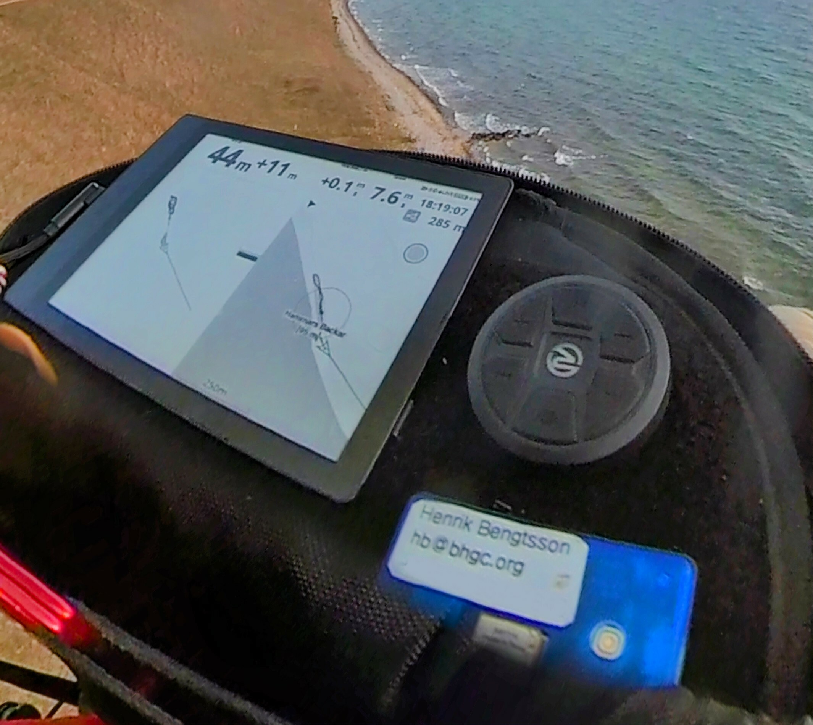

# My Paragliding Setup

_Last updated: 2023-07-09_

I've got the following devices on my paragliding cockpit since May
2022:

* Display: [ONYX BOOX Poke 3] Android 6-inch e-reader running the
  XCTrack app.
  
  UPDATE May 2023: The 'ONYX BOOX Poke 3' (Android 10; 758×1024
  pixels; 1072×1448 pixels = 300 ppi) is discontinued and has been
  replaced by the [ONYX BOOX Poke 4 Lite] (Android 11; 758×1024 pixels
  = 221 ppi).  Two pilots have confirmed that the below instructions
  work also for the 'Poke 4 Lite' - they're happy with it.

* Vario: [BlueFlyVario] w/ Bluetooth & GPS v22

* Keyboard: [Recoil Waterproof Bluetooth Media Button]

Everything is attached using industrial-strength velcro. In addition
to this, I carry an Android phone in my pocket that shares internet
with the Poke 3 e-reader for XCTrack live location sharing and 
viewing.

<figure style="margin-top: 3ex;">
  
</figure>

I'm fairly happy with this setup. The readability of the e-reader is
excellent - the brighter the sun is, then better it is, and it's
already awesome on cloudy days. The e-reader has a touchscreen, but
since that works so and so with gloves, I use the five-button media
button as an external keyboard. The bluetooth connection between the
Poke 3 e-reader and the BlueFlyVario is 100% reliable and always
automatically. Same with the media button.

The only complaint I have is that one of the two BlueFlyVario has
twice refused to boot up. Unfortunately, when this happens, the _only_
way to get it working again is to reflash the firmware, but that
requires an MS Windows computer, which you probably don't bring on
your flying trip.  This has happend twice to me (August 2022, and
December 2022) - both times during flying trips ¯\\\_(ツ)\_/¯. I hope
that it won't happen again with the newer firmware I now got. OTH,
since it's only out of two identical varios that's been acting up,
there is a slight risk that one is a lemon.

## Procedure on launch

1. Power on the Poke 3

2. On Android phone, start WiFi hotspot

3. Confirm that the Poke 3 is connected to the phone's WiFi

4. Power on the BlueFlyVario vario

5. Start XC Track

6. Confirm that Bluetooth, GPS and live tracking work 
   
7. Power on the Media Button and confirm pressing left-right shifts
   XCTrack displays

The only little bit of friction in this set up is the hotspot setup
and making sure the Poke 3 has a wifi connection before launching
XCTrack.  Without that, it's just power on the devices and starting
the XC Track app.

## Gadget details

### Vario: BlueFlyVario with Bluetooth & GPS v22

I've got the [BlueFlyVario] with Bluetooth & GPS v22.  We ordered two on
2022-05-12 for 348 AUD (~240 USD) and received them 2022-05-29.

* Weight: 48 g

* Dimensions: 58 x 36 x 16 mm

* Battery: ~8 hours (w/ Bluetooth & electromagnetic transducer
  running). 2-3 hours to fully charge

* Power button: click to turn ON, long press to turn OFF

* Power button when already ON: short press toggles audio ON, BUZZER,
  and OFF. This is easy to press during a flight.

* Battery status (during startup):

  1. First beep is a 1.0s beep at 4000 Hz
  2. Followed by 1-6 "battery" beeps (indicating 3.6-4.2 V)
  3. Followed by a short 0.2s beep at 4000 Hz

* LED lights:

  - BLUE (Bluetooth):
  
      + Flash every second => Bluetooth scanning
      
      + Double flash every second => connected
      
      + Solid => Bluetooth module is disabled (settings
        `SecondsBluetoothWait`).  Fix by restarting vario

  - ORANGE (GPS):
  
      + 1.0s flashing => GPS 3D fix
      
      + off => no GPS fix
      
  - GREEN:
  
      + During startup
      
      + When pressing button
      
      + When lift beep sounds (setting `GreenLED`)

  - RED:
  
      + Charging (turns off if full charged, but may stays on for
        trickle charging)

* Track logs:

  - Capacity: ~60 hours at one-second intervals
  
  - Always on: when GPS has 3D fix (ORANGE flash)

### Display: ONYX BOOX Poke 3 Android 10 e-reader

I ordered the [ONYX BOOX Poke 3] e-reader from BestBuy USA on
2022-05-13 for 190 USD and received it on 2022-05-19.

* Weight: 150 g

* Dimensions: 153 x 107 x 6.8 mm

* Screen: 6.0 inch (90 x 120 mm), 1072 x 1448 px (300 ppi), 16 gray
  scales

* Android: 10

* Google Play Store: no/maybe (failed to install it)

* Speaker: no

* XCTrack: Install via [APK](https://xctrack.org/Download.html)
  ([changelog](https://xctrack.org/Change_Log.html))

## Configuration

### Poke 3 and XCTrack

The Poke graphical user interface (GUI) can be a bit peculiar at
first. For example, it uses it's own on-screen keyboard and it also
has a, so called, 'Navigation Ball'.  It's a small round blob that
sits in front on any app you open.  You'll need it.  If you click it,
you'll get access to more action buttons, and one commonly used one is
the "back" button.

In order for XCTrack to go into landscape, which you can set inside
XCTrack by going to 'Preferences' and then 'Orientation', you must
configure the app such that it can override the 'Rotation' settings
that the Poke GUI uses, which is 'Portrait' by default.  To do this:

1. Long press 'XCTrack' app icon
2. Select 'Optimize'
3. Go to the 'Others' tab
4. Disable 'Force to use system orientation' (i.e. set it to OFF)

### Poke 3, BlueFlyVario, and XCTrack

Use BlueFlyVario as an external GPS in XTrack:

1. **Pairing**: In Poke 3 Bluetooth settings, pair BlueFlyVario device
   (e.g. BlueFly-7D0D). No PIN required.

2. **Enable location**: In Poke 3, open the 'Control Center' in the
   Poke 3/Android pulldown menu. There you should see WiFi and
   Bluetooth buttons at the very top.  Below are two panels, both
   showing a set of icons that can be used to toggle settings on and
   off.  The top panel, of these two, has a volume bar and the bottom
   one a brightness bar and a contrast bar.  In the top panel, enable
   'Location' by clicking on the map icon. This icon might be in the
   second "subscreen", which you can get to by swiping left inside the
   panel.  **IMPORTANT**: if this is not done, then you cannot connect
   the BlyFlyVario device in XCTrack (at least not on Poke 3).

3. **External GPS and External Barometer in XCTrack**: In XCTrack, go
   to 'Preferences', then 'Connections & Sensors'.

   a. Under 'Connection', click 'External sensors', select 'Bluetooth
      sensor' and click 'OK'.  It will scan for paired Bluetooh
      devices. Select the BlueFlyVario device (e.g. BlueFly-7D0D).

   b. Under 'GPS', enable 'Use external GPS'.  **IMPORTANT**: If you
      forget this, XCTrack will never recieve GPS data therefore only
      report on the lift and sink (from the barometer in
      BlueFlyVario).  When it works, XC Track will give the 'GPS
      signal OK' notification and it will show GPS altitute, the
      speed, flight arrow, and more even when on the group.

   c. Under 'Atmospheric pressure sensor', enable 'Use external
      barometer'.  **IMPORTANT**: If you forget this, I think XCTrack
      will use the GPS data, which is much less sensitive, to report
      on lift and sink.

### BlueFlyVario setting

Options to change hardware settings:

* Android: [BlueFlyVario Android App] (installable on Poke 3)
  Download: <https://blueflyvario.com/files/BlueFlyVario.apk>
    
* Any operating system: [BFV Desktop Java Application]
  Download: <https://blueflyvario.com/files/BFVDesktop0.85.zip>

For Poke 3, which does not have a speaker, change:

* `UseAudioWhenConnected`: `true` (default `false`)

### Recoil Media Button settings

This device broadcasts itself on Bluetooth as 'PCR-1'. To pair to the
Poke 3, go to the Bluetooth settings and locate 'PCR-1' under
'Available devices'.  Then click on 'PCR-1' to pair it.  When paired
it will appear under 'CONNECTED DEVICES'.  When powered off, it will
be listed under 'PAIRED DEVICES', which are the devices that the Poke
3 remembers.

When powered on, the Poke 3 will immediately connect to the Recoil
Media Button device.

The device goes automatically into a [sleep mode after 20
minutes](recoil/Recoil_PCR-1-UserManual.pdf). This is to preserve
battery. Pressing any button (Previous track, Next track, Volumn Down,
Volume Up, PAUSE/PLAY) will wake it up with very little delay.

To configure what the buttons should do, open XC Track, go to
'Preferences', andthen 'Key bindings'.  I use the following settings:

* Switch to page left: Previous track
* Switch to page right: Next track
* Zoom map in: None
* Zoom map out: None
* Toggle map panning: Long press: 85
* Pan map LEFT in panning mode: Long press: Previous track
* Pan map RIGHT in panning mode: Long press: Next track
* Pan map UP in panning mode: Volumn Up
* Pan map DOWN in panning mode: Volumn Down
* Show menu: None
* Revert to previous waypoint in task: None
* Advance to previous waypoint in task: None
* Increase display brightness: None
* Decrease display brightness: None

[BlueFlyVario]: https://www.blueflyvario.com/
[BlueFlyVario Android App]: https://www.blueflyvario.com/software/
[BFV Desktop Java Application]: https://www.blueflyvario.com/software/
[Recoil Waterproof Bluetooth Media Button]: https://smile.amazon.com/gp/product/B085BYDHG9/
[ONYX BOOX Poke 3]: https://onyxboox.com/boox_poke3
[ONYX BOOX Poke 4 Lite]: https://onyxboox.com/boox_poke4lite
