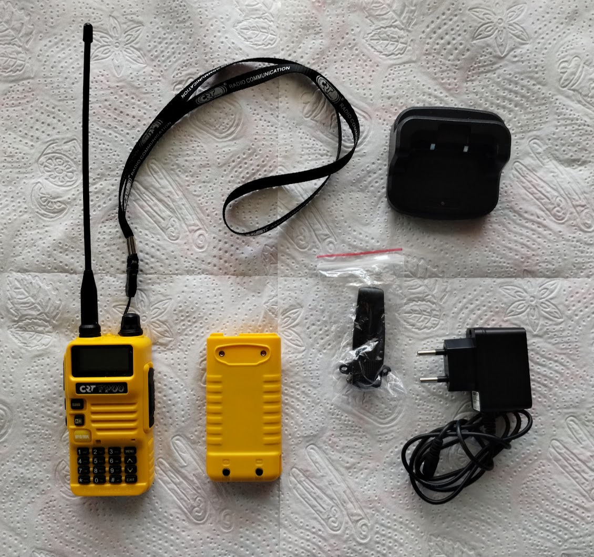
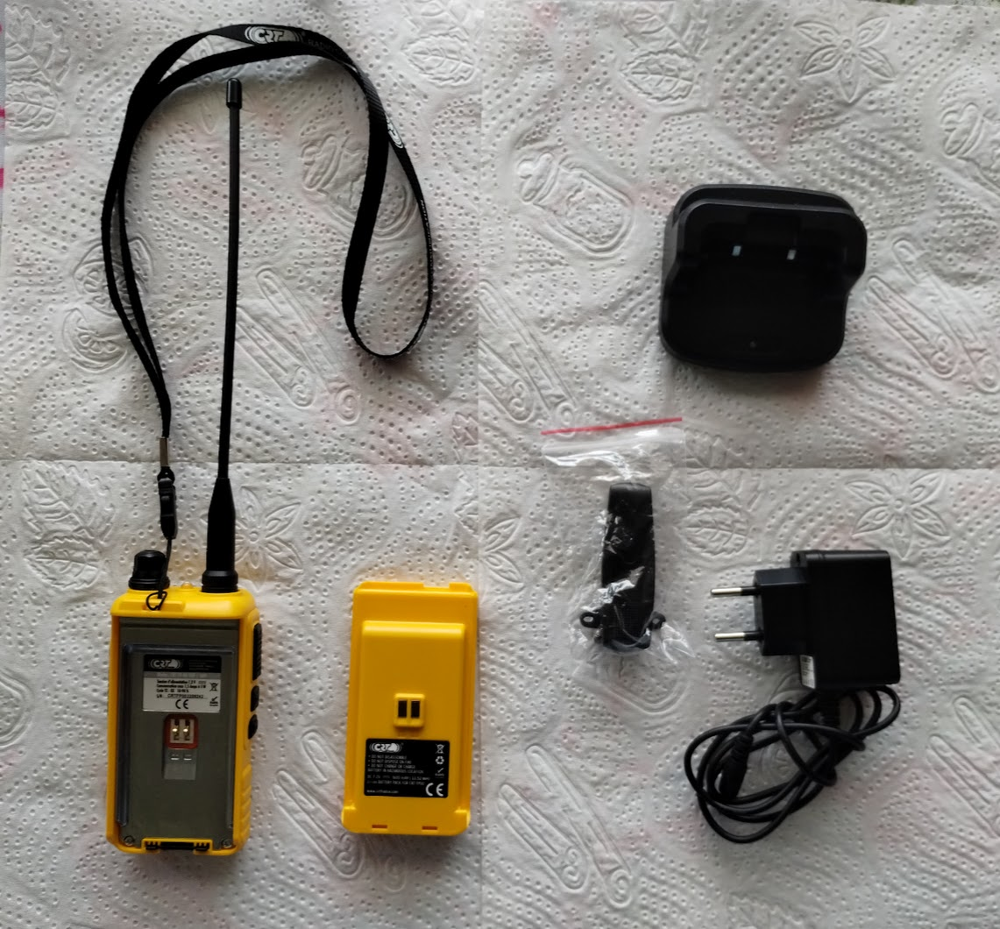
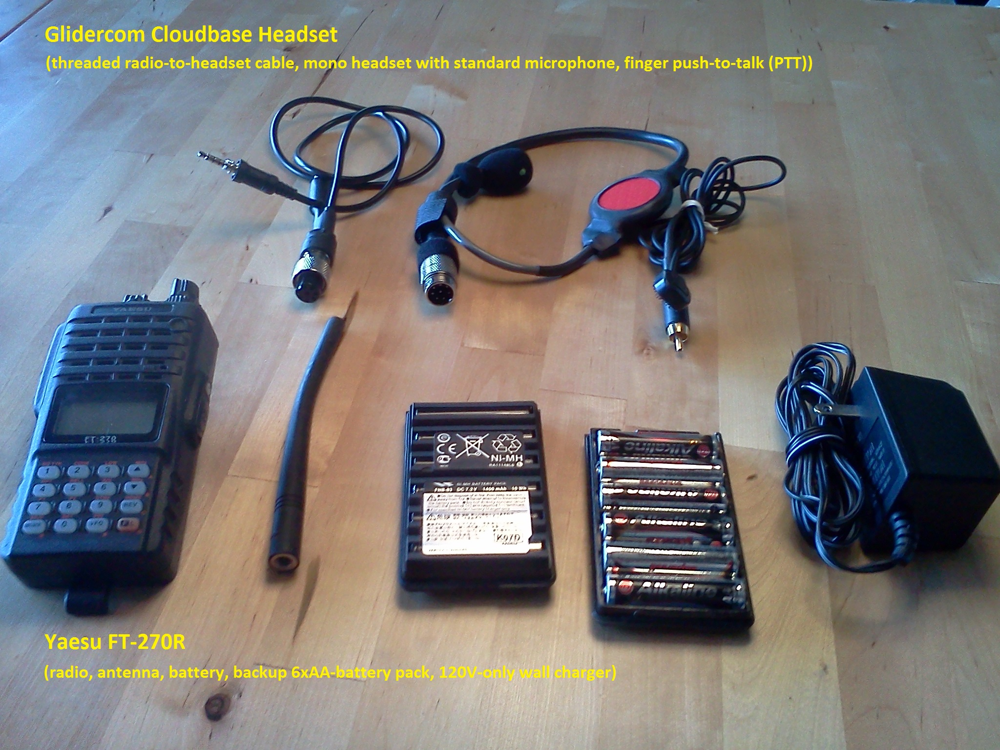

# Ham Radio

## Baofeng UV-5R

I use a [Baofeng UV-5R] since several years back.  The reason for this
is that they are easy to get in the US, the cost is only 40-50 USD, so
it's not a biggie to get a replacement, keep a backup, and buy spare
batteries.

_Comment_: According to
[Wikipedia](https://www.wikipedia.org/wiki/Baofeng_UV-5R), "the model
variant Boafeng UV5R HT" is no longer sold in Germany and Switzerland
and may not be used there.

## CRT France FP 00 (temporary)

I got a [CRT France FP 00] radio in France 2023 when I was on the Saint Hilare
launch realizing my the battery in my Baofeng radio was dead.  I got
it for 47 EUR from the Prevol shop at launch. I was lucky because it
had the same headset connection as my Baofeng, so it worked with my
PTT headset.  It a Baofeng clone with the same configuration and menu
items(*). The battery and the charger, including the plug to the
charging dock is different though.  I haven't tried, but it also looks
like CHIRP (programming via cable) is not support (yet),
e.g. <https://chirp.danplanet.com/issues/9894>.

(*) I walked through the menu on the CRT-FP00 and the Baofeng UV-5R
step by step and the menu entries were identical.

## Yaesu FT-270R (legacy)

In the past, I used my [Yaesu FT-270R] radio with a custom-build
push-to-talk (PTT) headset. It worked great, but once in a while, and
always during flying trips, the headset connection to the radio broke.
The problem with the Yaseu FT-270R is that it has a screw-in plug (see
picture).  The purpose of that is so that the plug does not fall out,
but the problem was that slowly you end up twisting the cable too much
so that the cables inside break. It happened twice to me at launch
during flying trips. I loved the custom-made Glidecom Cloudbase
Headset, but it was custom built by a guy in Oregon and delivery was
flaky at best, so this solution became unreliable in the long run. I
never managed to find another nicec headset, so I switched to a
cheaper, lower-quality Baofeng radio.

[Baofeng UV-5R]: https://baofengtech.com/product/uv-5r/
[CRT France FP 00]: https://www.crtfrance.com/en/amateur-radio-talky-walky/824-crt-fp-00.html
[Yaesu FT-270R]: https://www.yaesu.com/indexVS.cfm?cmd=DisplayProducts&ProdCatID=111&encProdID=87CE6C1FF54D5BBCA7F39179AB3B1511