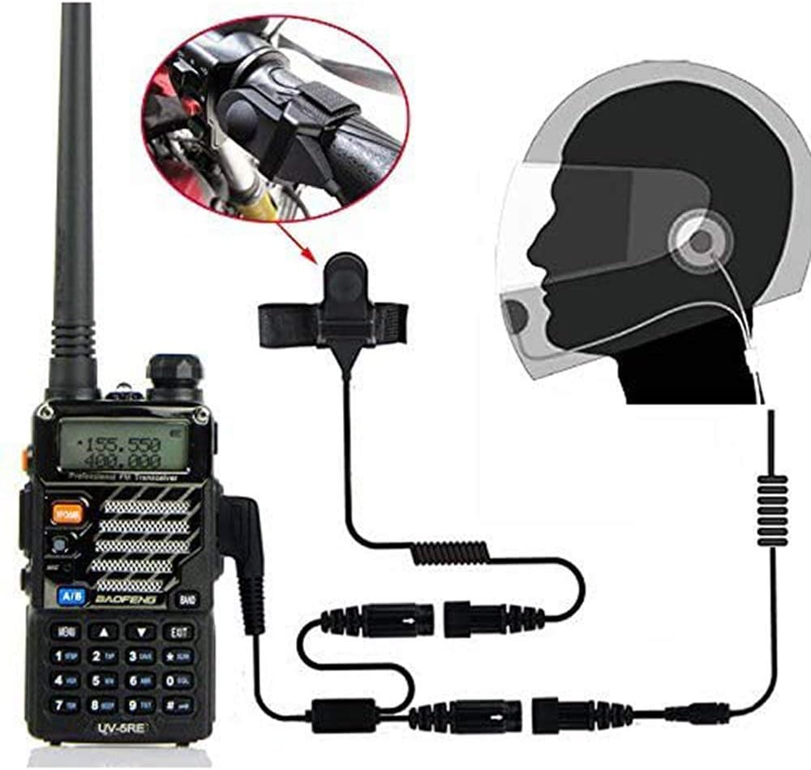
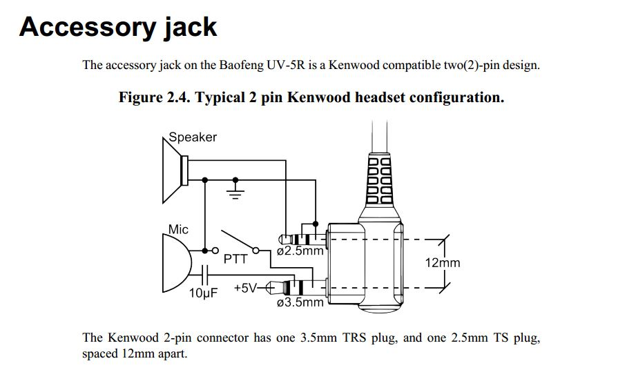
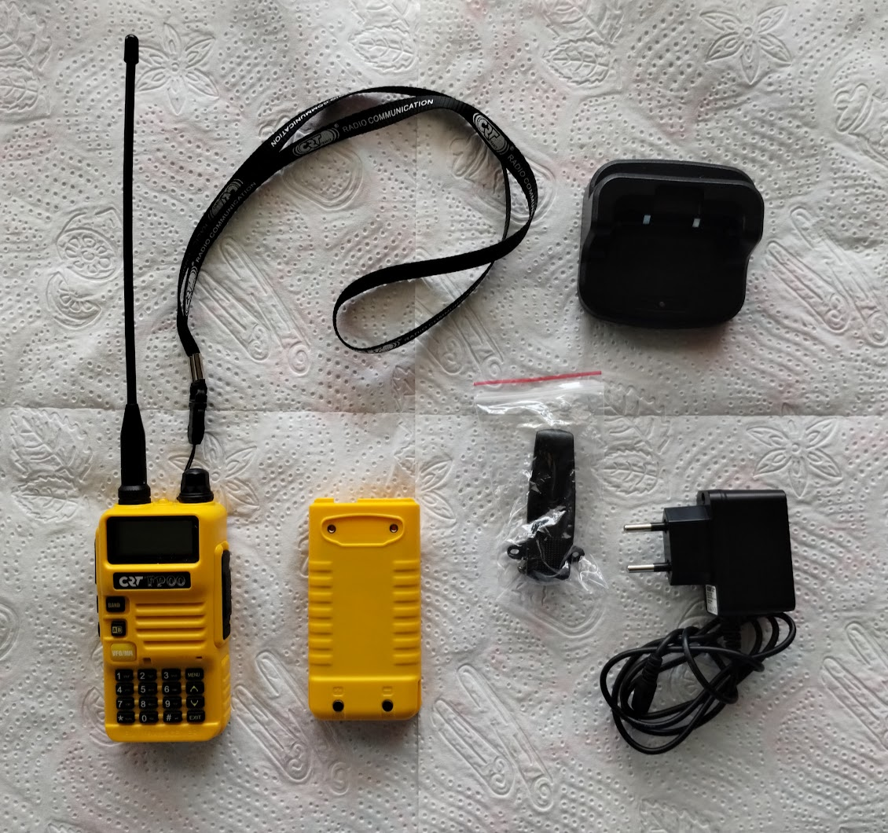
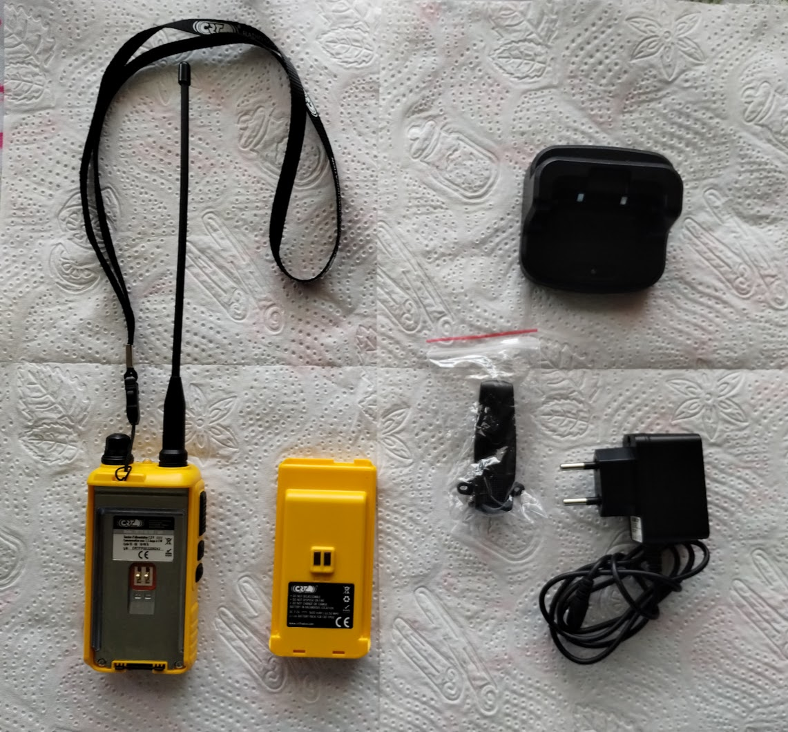
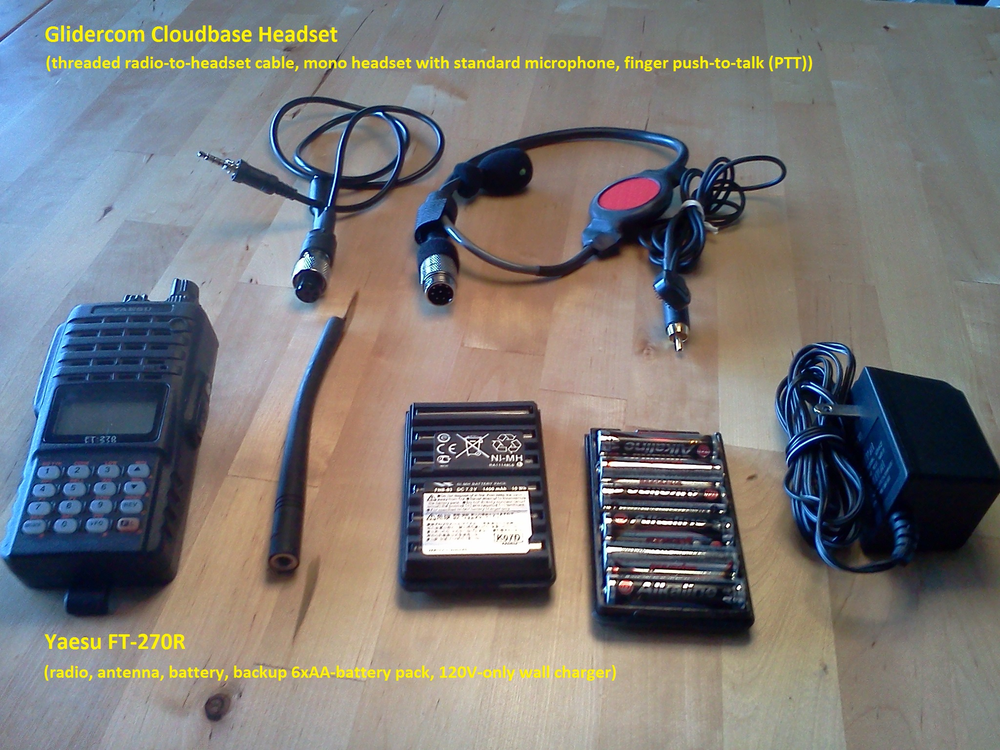

# Ham Radio

## Baofeng UV-5R

I use a [Baofeng UV-5R] since several years back.  The reason for this
is that they are easy to get in the US, the cost is only 40-50 USD, so
it's not a biggie to get a replacement, keep a backup, and buy spare
batteries.  The Baofeng UV-5R handset uses the a [Kenwood compatible
two-pin plug]; one plug is 2.5mm and the other is 3.5mm and are 12mm
apart. Because of this, I have a fair bit of head sets with
push-to-talk (PTT) buttons to choose from. I place the PTT button on
my left riser near my break handle, because that way I can easily
transmit also in active air and while thermalling.  I have the headset
and the mic mounted permanently on my helmet.

On launch, I put on my helmet, let the cable hang down before I close
my jacket, then I connect it together with the PTT cable that I run
down the riser thought the carabiner, and at the end I plug it to the
radio that is on my flight deck.  I then turn on the radio to confirm
that I can hear "Frequency mode" or "Channel mode" that the radio says
when turned on.  After this, I do a formal radio check.

{width=49%}
{width=49%}

_Comment_: According to
[Wikipedia](https://www.wikipedia.org/wiki/Baofeng_UV-5R), "the model
variant Boafeng UV5R HT" is no longer sold in Germany and Switzerland
and may not be used there.

Our radio units:

* 2 UV-5R MK4 with 'MIRKIT' on the front. Label on the back: Model:
   UV-5R MK4 Mirkit Edition, Voltage: 7.4V, Power: 8W, Frequency:
   136-174 MHz/400-520 MHz, S/N: UV-5R MK4 A00163, S/N: UV-5R MK4
   A00163. Purchased 2019-03-30 and 2019-06-14.

* 4 UV-5R MK4 with 'UV-5R MK4' on the front.  Label on the back:
   Model: UV-5R MK4 Max Power Mirkit Edition, Voltage: 7.4V, Power:
   8W, Frequency: 136-174 MHz/400-520 MHz, S/N: UV-5R MK4
   A21895. FCCID: 2AJGM-UV5R. Purchased 2021-12-20.

Batteries:

* Model: BL-5. Li-ion battery 7.4V 1800mAh.

### PTT Headset

The [PTT headset I use](https://www.amazon.com/dp/B081QKHWP4)
is 15-20 USD on Amazon.  

{width=69%}
{width=29%}

It has two flat ear pieces with speakers and a microphone on a
three-way splitted cable with a male threaded ~13mm 5-pin circular
connector[^1] at the end.  You mount the ear pieces inside your helmet
and let the cable, which reaches your chest, hang down.  The
Push-to-Talk (PTT) button sits on another cable that also terminates
with a male 5-pin connector.  The third part of this kit is a Y-split
connector where one end is a standard male 2-pin type K headset
connector that plugs into the radio, and the other two ends are female
5-pin connectors that connects to your headset and PTT, respectively.

[^1]: It still unknown exactly what standard the 5-pin connectors are,
if a standard at all. As far as I know, it is _not_ a 5-pin [DIN
connector](https://en.wikipedia.org/wiki/DIN_connector), because they
have symmetrically located pins, whereas this headset has three pins
on one side and two on the other (as if it missed the upper pin). It
also has a thin rectangular guiding pin/hole in the center.  The
sheets of these 5-pin connectors can be removed with a teeny hex key 
(0.035in, but 0.9mm works too). That said, nothing useful is 
accessible under the sheet; the threads and internal connectors appear
to be encapsulated within a solid mass of plastic.

### Alternative antennas

The Baofeng UV-5R handset uses a [SMA (SubMiniature version A)
connector](https://en.wikipedia.org/wiki/SMA_connector) for the
antenna. The handset has a male connector (inside threads) and the
antenna a female connector (outside threads).

{width=40%}
&nbsp; &nbsp; &nbsp; &nbsp;
{width=50%}

In addition to the antenna that comes with the radio, I have a Nagoya
NA-771 40cm Whip VHF/UHF (144/430Mhz) Antenna (SMA-Female) ([~20 USD
on Amazon](https://www.amazon.com/dp/B00KC4PWQQ/)) (left), which I
never really used, because I mount my radio on my flight deck and then
this long antenna sticks too far out.

I've recently started to experiment with a 72cm foldable tactical
antenna with a coax extension cord ([~17 USD on
Amazon](https://www.amazon.com/dp/B094R6GW8Y/)) (right).  I place the
antenna upside-down in my harness and pull the extension cord over my
sholder and down to the radio unit.  This adds an extra step of having
to screw on the antenna before each launch. To avoid that, I keep it
connected and let the radio hang from it while I connect my harness
and put on the flightdeck.  I use a 100cm extension cord ([~11 USD on
Amazon](https://www.amazon.com/dp/B07SC3VQM5)) in order to reach over
my shoulder and down inside of my jacket to my flight deck.

Another alternative that I've considered would be a wire antenna,
which is basically a wire (e.g. [H07V-K
4](https://www.awcwire.com/product/h07v-k-4)) on an female [SMA
connector](https://en.wikipedia.org/wiki/SMA_connector). See
<https://ham.stackexchange.com/questions/140/good-wire-for-wire-antenna#181>
for how to build one.

## CRT France FP 00 (temporary)

I got a [CRT France FP 00] radio in France 2023 when I was on the Saint Hilare
launch realizing my the battery in my Baofeng radio was dead.  I got
it for 47 EUR from the Prevol shop at launch. I was lucky because it
had the same headset connection as my Baofeng, so it worked with my
PTT headset.  It a Baofeng clone with the same configuration and menu
items[^2]. The battery and the charger, including the plug to the
charging dock is different though.  I haven't tried, but it also looks
like CHIRP (programming via cable) is not support (yet),
e.g. <https://chirp.danplanet.com/issues/9894>.

[^2]: I walked through the menu on the CRT-FP00 and the Baofeng UV-5R
step by step and the menu entries were identical.

{width=49%}
{width=49%}

## Yaesu FT-270R (legacy)

In the past, I used my [Yaesu FT-270R] radio with a custom-build
push-to-talk (PTT) headset. It worked great, but once in a while, and
always during flying trips, the headset connection to the radio broke.
The problem with the Yaseu FT-270R is that it has a screw-in plug (see
picture).  The purpose of that is so that the plug does not fall out,
but the problem was that slowly you end up twisting the cable too much
so that the cables inside break. It happened twice to me at launch
during flying trips. I loved the custom-made Glidecom Cloudbase
Headset, but it was custom built by a guy in Oregon and delivery was
flaky at best, so this solution became unreliable in the long run. I
never managed to find another nicec headset, so I switched to a
cheaper, lower-quality Baofeng radio.

[Baofeng UV-5R]: https://baofengtech.com/product/uv-5r/
[CRT France FP 00]: https://www.crtfrance.com/en/amateur-radio-talky-walky/824-crt-fp-00.html
[Yaesu FT-270R]: https://www.yaesu.com/indexVS.cfm?cmd=DisplayProducts&ProdCatID=111&encProdID=87CE6C1FF54D5BBCA7F39179AB3B1511
[Kenwood compatible two-pin plug]: https://ham.stackexchange.com/a/3638
